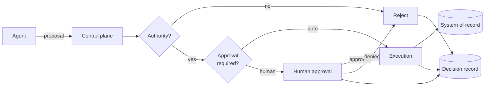

# Enterprise AI Architecture Notes

> **An agent may propose; the system decides whether to execute.**

## What this is

Architecture notes on AI agents that act inside enterprise systems. The interesting
problem is not *what the model can do* — it's *what the system is allowed to let it
do*. Everything here (authority models, approval gates, audit traces) is machinery
built to enforce and observe one boundary: the agent proposes, and a separate,
non-model control plane decides whether to execute.

The notes are opinionated and self-contained. Every scenario, JSON, and YAML file
is synthetic.

## Overview

An agent emits a **proposal**. A deterministic control plane checks **authority**,
routes for **approval** when policy requires it, and only then **executes** —
writing a **decision record** at every branch, including rejection.

## The three notes

Read them in order — each builds on the last.

| # | Note | Thesis |
|---|------|--------|
| 01 | [Proposal vs. Execution](notes/01-proposal-vs-execution/) | The agent only proposes; a distinct control plane decides whether to execute and records what happened. |
| 02 | [Authority and Approval](notes/02-authority-and-approval/) | Being able to propose an action is not the same as being allowed to perform it. |
| 03 | [Agent Audit Trace](notes/03-agent-audit-trace/) | If you cannot reconstruct why an action happened, you did not control it. |

## Worked example

[Synthetic Vendor Onboarding](examples/synthetic-vendor-onboarding/) ties the three
notes into one end-to-end story — a routine auto-approved case and an escalated case
that is denied, fed back as a constraint, and re-proposed.

## Reusable patterns

Five recurring building blocks the notes refer to:

- [Proposal Gate](patterns/proposal-gate.md) — normalize and validate agent output into a proposal
- [Authority Gate](patterns/authority-gate.md) — check the actor's authority against policy
- [Human Approval Gate](patterns/human-approval-gate.md) — route to a person when required
- [Execution Gate](patterns/execution-gate.md) — the only place side effects happen
- [Decision Record](patterns/decision-record.md) — the durable, append-only account of what was decided

## Who this is for

- Engineers designing agent systems that touch systems of record.
- Architects and reviewers who sign off on "can we let the agent do this?"
- Risk and compliance readers who need the authority and approval models to be legible without reading code.

## Scope and limitations

**In scope:** the proposal/execution separation, authority and delegation, human
approval routing, audit traces, and the reusable patterns above.

**Out of scope:** model internals and prompting technique, vendor/tool selection, a
reference implementation (the JSON/YAML are illustrative schemas, not shipped code),
and any real deployment. Nothing here describes a specific organization's systems,
policies, or data.

Full detail in [`docs/scope.md`](docs/scope.md).

## Start here

Read [Note 01 — Proposal vs. Execution](notes/01-proposal-vs-execution/), then work
through 02 and 03 in order. The [patterns](patterns/) are referenced throughout and
can be read on demand.

## A note on the data

Every scenario, JSON, and YAML file is **synthetic**. No real vendor, customer,
employee, credential, or internal system is described; identifiers carry a
`-synthetic` suffix and hosts use `example.invalid`.

## Status

Working notes. Opinionated, not authoritative. Corrections and counterexamples are welcome.

## License

Copyright © 2024–2026 Brad Kaufman. All rights reserved.
