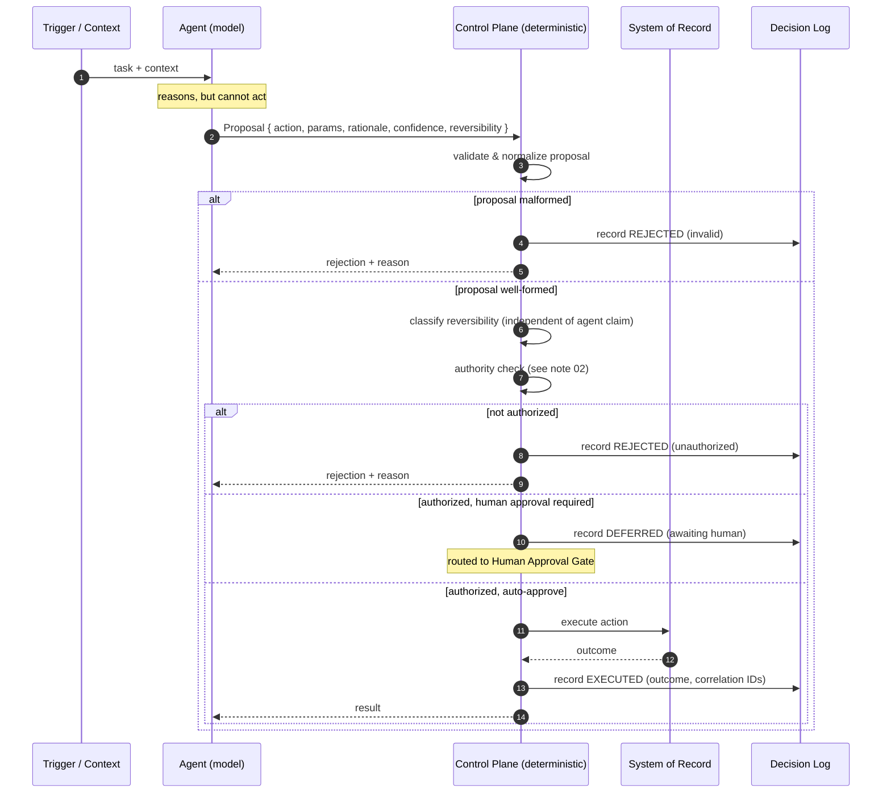

# 01 — Proposal vs. Execution

> An agent may propose. The system decides whether to execute.

This is the foundational separation. If you get this boundary right, the rest of
the architecture (authority, approval, audit) has a clean place to live. If you
get it wrong — if the model both decides *and* acts — there is no seam where
policy, review, or accountability can be inserted.

## The problem

A naive agent loop looks like this:

```
model → tool call → side effect → model → tool call → side effect → ...
```

The model is in the driver's seat. Each tool call is an *action* against a real
system. There is no distinct moment where anyone (or anything) that isn't the
model gets to say "no" before the side effect lands. Failures are therefore:

- **Unattributable** — the reasoning that led to the action is transient chat state, not a record.
- **Unauthorizable** — there's no proposal object to check authority against; the action *is* the check.
- **Irreversible in practice** — by the time you see the tool call in a log, it already ran.

## The separation

Split the loop into two stages with a hard boundary between them:

```
                 ┌─────────────┐        ┌──────────────┐
   context  ───► │    AGENT    │  ────► │   CONTROL    │ ────► side effect
                 │  (proposes) │  PROP  │   PLANE      │        (maybe)
                 └─────────────┘        │ (decides +   │
                                        │  executes)   │
                                        └──────────────┘
```

**Stage 1 — Proposal.** The agent's *only* output is a **proposal**: a
structured, declarative description of an action it believes should happen. It
has no ability to cause a side effect directly. A proposal is data, not a call.

**Stage 2 — Execution.** A separate control plane — deterministic code, not a
model — receives the proposal, evaluates it (validation, authority, approval,
policy), and either executes it or rejects it. Whatever it does, it writes an
**execution record**.

The model never touches a system of record. It only ever produces proposals.

The full sequence — validation, reversibility classification, the authority check,
and the auto-approve vs. defer branches — is below (source: [`flow.mmd`](flow.mmd)):



## What a proposal is

A proposal is a self-describing intent. At minimum it carries:

- **`action`** — the operation being requested (from a known, enumerated set).
- **`parameters`** — the fully-resolved arguments (no "figure it out later").
- **`rationale`** — why the agent believes this action is warranted, in prose, for human reviewers.
- **`confidence`** — the agent's own calibrated confidence, used for routing.
- **`reversibility`** — the agent's claim about whether this can be undone (the control plane verifies, never trusts).

A proposal is **not** a promise that the action will happen. It is a request
that the action be *considered*. The control plane is free to reject it.

See [`example-proposal.json`](example-proposal.json) for a complete synthetic proposal.

## What an execution record is

For every proposal that reaches the control plane — executed *or not* — the
system writes an execution record. This is the durable account of the decision.
It captures:

- the proposal that came in (by reference or embedded),
- the decision (`executed` / `rejected` / `deferred-to-human`),
- who or what made the decision,
- the actual outcome, including any effect on a system of record,
- correlation IDs that let you reconstruct the whole chain later.

Crucially, **a rejected proposal still produces a record.** "We chose not to act"
is itself an auditable decision.

See [`example-execution-record.json`](example-execution-record.json).

## Why this is the right seam

Once proposals are first-class data objects, every other control becomes a
function over that object:

- **Authority** (note 02) is `authorized(actor, proposal) → bool`.
- **Approval** (note 02) is `requiresHuman(proposal) → bool` plus a routing step.
- **Audit** (note 03) is "keep every proposal and every execution record, linked."

None of those are expressible if the model just calls tools directly. The
proposal object is the thing they all attach to.

## Anti-patterns

- **Trusting the proposal's `reversibility` field.** The agent asserts it; the
  control plane must independently classify the action. An agent that
  mislabels a destructive action as reversible must not be able to talk its way
  past the gate.
- **Letting the model retry past a rejection.** A rejection is a decision. If the
  model can immediately re-propose a slightly reworded version until it slips
  through, the gate is theater. Rejections must feed back as constraints, not be
  silently discarded.
- **A "fast path" that skips the control plane for low-risk actions.** The moment
  there are two paths, the audit story has a hole. Route *everything* through the
  control plane; let the plane decide that low-risk actions auto-approve.

## Related patterns

- [Proposal Gate](../../patterns/proposal-gate.md)
- [Execution Gate](../../patterns/execution-gate.md)
- [Decision Record](../../patterns/decision-record.md)

---

[← Home](../../README.md) · Next: [02 — Authority and Approval →](../02-authority-and-approval/)
