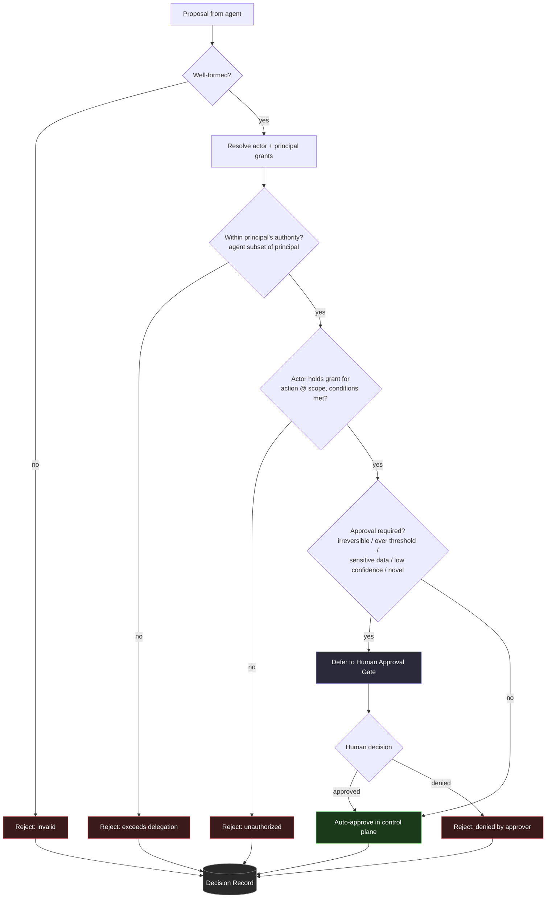

# 02 — Authority and Approval

> Being able to propose an action is not the same as being allowed to perform it.

Note 01 established that agents produce **proposals** and a control plane decides
whether to **execute**. This note is about the core of that decision: *is this
actor allowed to do this thing, and does a human need to sign off first?*

Two distinct questions, often conflated:

1. **Authority** — Does the actor (agent, or the human on whose behalf it runs)
   hold the grant required for this action, at this scope? This is a
   *permission* question. Deterministic. Yes/no.
2. **Approval** — Even if authorized, does policy require a *human* to approve
   this specific instance before it executes? This is a *risk-routing* question.

An action can be authorized but still require approval. An action can never
require approval *and* be executed by an unauthorized actor — authority is
checked first.

## The authority model

Authority is a grant of `(actor, action, scope, conditions)`. We keep it
declarative and boring on purpose — it must be inspectable by people who are not
engineers (risk, compliance, the vendor's own approvers).

```
grant := actor may perform ACTION on SCOPE when CONDITIONS hold
```

- **actor** — an identity, or a role that identities map to. Agents are actors
  too, and they get *narrower* grants than the humans they assist, never wider.
- **action** — from the same enumerated set the proposal draws from.
- **scope** — the blast radius: which records, which value bands, which
  environments.
- **conditions** — predicates over the proposal and context (amount thresholds,
  time windows, data classification).

The diagram below shows how a proposal flows through authority evaluation into an
approval decision (source: [`authority-model.mmd`](authority-model.mmd)); see
[`authority-policy.yaml`](authority-policy.yaml) for a worked synthetic policy.



## The delegation invariant

> An agent's authority is a **subset** of the authority of the principal it acts for.

An agent acting for a purchasing manager can never do something the purchasing
manager couldn't. This bounds the worst case: a fully compromised or fully
hallucinating agent can, at most, do what its principal was already permitted to
do — and even that is further narrowed by the agent's own (tighter) grants.

This is why "give the agent admin so it doesn't get stuck" is a security
incident waiting to happen. The correct answer to a stuck agent is a **proposal
that gets deferred to a human**, not a broader grant.

## When a human must approve

Authorization gets you past the "may this happen at all" gate. Approval routing
decides "should a person look at *this specific instance* first." Route to a
human when **any** of these hold:

- the action is **irreversible** or reversible only at material cost,
- a **value threshold** is crossed (amount, count, breadth of affected records),
- the proposal touches **regulated or sensitive data**,
- the agent's **confidence is below** the band policy requires for autonomy,
- the action is **novel** — outside the distribution the auto-approve band was
  calibrated for,
- an explicit **four-eyes** rule applies to this action class.

Everything else can auto-approve — *within the control plane*, still producing a
full record.

The full routing logic is in the [decision table](decision-table.md).

## Approval is a gate, not a rubber stamp

If approval is to mean anything:

- The approver must see the **proposal, its rationale, and its classification** —
  not just "approve action X?" with no context.
- The approval (or denial) is itself a **recorded decision** with the approver's
  identity, timestamp, and any comment.
- A denied proposal does **not** get silently retried. It comes back as a
  constraint the agent must respect.
- Approvals **expire**. An approval granted against one state of the world does
  not authorize execution against a materially changed state later.

## Failure modes this prevents

- **Confused-deputy** — the agent is tricked into taking an action its principal
  wouldn't, but the delegation invariant caps it at the principal's authority,
  and approval routing catches the high-risk ones.
- **Privilege creep via retries** — a proposal that fails authority cannot be
  re-rolled into approval; the two gates are ordered and independent.
- **Silent autonomy expansion** — because auto-approve is a *band* defined in
  policy (not "no human was around"), widening it is a reviewable policy change,
  not an accident.

## Related patterns

- [Authority Gate](../../patterns/authority-gate.md)
- [Human Approval Gate](../../patterns/human-approval-gate.md)
- [Decision Record](../../patterns/decision-record.md)

---

[← 01 — Proposal vs. Execution](../01-proposal-vs-execution/) · [Home](../../README.md) · Next: [03 — Agent Audit Trace →](../03-agent-audit-trace/)
