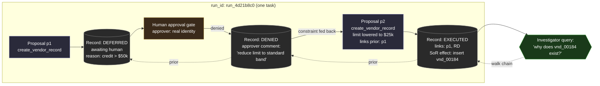

# 03 — Agent Audit Trace

> If you cannot reconstruct why an action happened, you did not control it — you
> just got lucky.

Notes 01 and 02 built the seam (proposal vs. execution) and the gates (authority,
approval). This note is about the thing that makes all of it *accountable*: a
durable trace that lets someone — days or months later, during an incident review
or an audit — reconstruct exactly what the agent proposed, what the system
decided, who decided it, and what happened to the systems of record.

The audit trace is not logging. Logging is for engineers debugging. The audit
trace is a **first-class product surface** with its own guarantees.

## What the trace must let you answer

For any effect on a system of record, an investigator must be able to answer, from
the trace alone:

1. **What happened?** The concrete effect (insert/update/delete, on what entity).
2. **What was proposed?** The originating proposal, verbatim — action, params, rationale, confidence.
3. **Who or what decided?** Control-plane auto-approve, or a named human approver.
4. **On what basis?** The authority grant relied on, the policy version, the approval routing outcome.
5. **What was the context?** The trigger, the inputs the agent saw, the model/agent version.
6. **What else did this touch?** Everything correlated to the same run/trace.

If a field is missing, the corresponding question is unanswerable, and the trace
has failed at exactly the moment it mattered.

## The unit of the trace: the decision record

The atom of the audit trace is the **decision record** — one per proposal that
reached the control plane, whether it was executed, rejected, or deferred. See
[`decision-record.json`](decision-record.json) for a complete synthetic record,
and the [Decision Record pattern](../../patterns/decision-record.md) for the
schema and invariants.

Every decision record is:

- **Append-only.** Records are never edited or deleted. A correction is a *new*
  record that references the old one.
- **Self-contained enough to stand alone.** It embeds or hard-references the
  proposal, the decision, the decider, and the outcome. You should not need three
  other systems online to read one record.
- **Correlated.** It carries `run_id`, `trace_id`, and links to related records so
  a chain of proposals can be walked end-to-end.

## The trace as a graph

A single task rarely produces a single proposal. It produces a *chain*: propose →
maybe defer → maybe re-propose under a constraint → execute. The audit trace is
therefore a graph, not a line.

The diagram below shows how records link into a reconstructable chain — including
the branches for denial and human deferral, and an investigator walking it backward
(source: [`audit-flow.mmd`](audit-flow.mmd)):

## Non-negotiable properties

- **Write-before-effect.** The intent-to-execute record is written *before* the
  side effect, and the outcome record *after*. A crash mid-execution must leave a
  record that says "we were about to do X" — never a silent gap.
- **Tamper-evidence.** Records are hash-chained or otherwise integrity-protected,
  so after-the-fact editing is detectable. An audit trail you can quietly rewrite
  is not an audit trail.
- **Attributable to a real identity.** Human decisions carry a real, authenticated
  identity — never "an operator." Agent decisions carry the agent id *and* the
  principal it acted for.
- **Retained to policy.** The trace outlives the run, the incident, and often the
  employee. Retention is set by compliance, not by disk pressure.
- **Redaction without erasure.** Sensitive values may be redacted for most
  viewers, but the record that *something* happened, and its shape, is never
  erased. Redaction ≠ deletion.

## What goes wrong when the trace is weak

Concrete, synthetic incident walk-throughs — each showing how a specific gap in
the trace turns a recoverable situation into an unaccountable one — are in
[`failure-scenarios.md`](failure-scenarios.md).

The recurring theme: the failures are rarely the model doing something exotic.
They are ordinary decisions that no one can *reconstruct* afterward, because the
trace didn't capture the one field that mattered.

## Related patterns

- [Decision Record](../../patterns/decision-record.md)
- [Execution Gate](../../patterns/execution-gate.md)
- [Human Approval Gate](../../patterns/human-approval-gate.md)

---

[← 02 — Authority and Approval](../02-authority-and-approval/) · [Home](../../README.md) · Next: [Worked example: Vendor Onboarding →](../../examples/synthetic-vendor-onboarding/)
